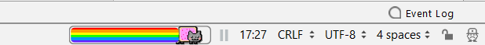

NyanProgressBar
===============

A pretty nyan cat progress bar for IntelliJ IDEA and other JetBrains IDEs.

[Page on plugin repository site](https://plugins.jetbrains.com/plugin/8575-nyan-progress-bar)

### This Fork

I forked from [batya239](https://github.com/batya239/NyanProgressBar) with the intention of merging code from other forks such as [adrianblp/NyanProgressBar](https://github.com/adrianblp/NyanProgressBar) and [eokuwwy/PartyProgressBar](https://github.com/eokuwwy/PartyProgressBar). I'm planning to allow for the user to select variations of the statusbar from options that can be configured in the IDE settings.
